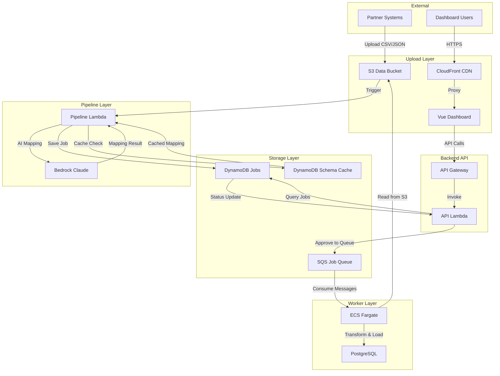
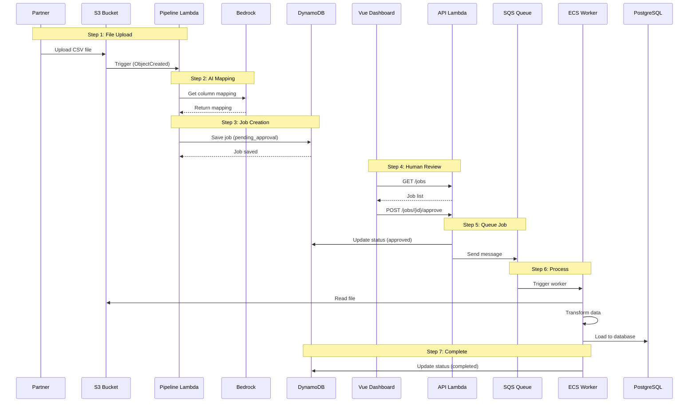
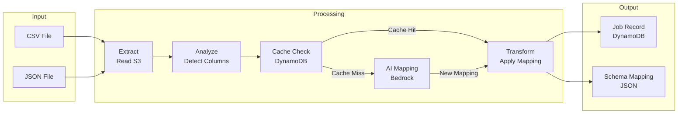
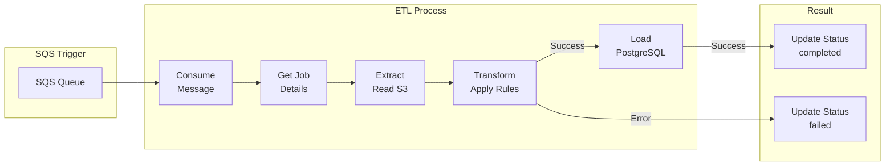
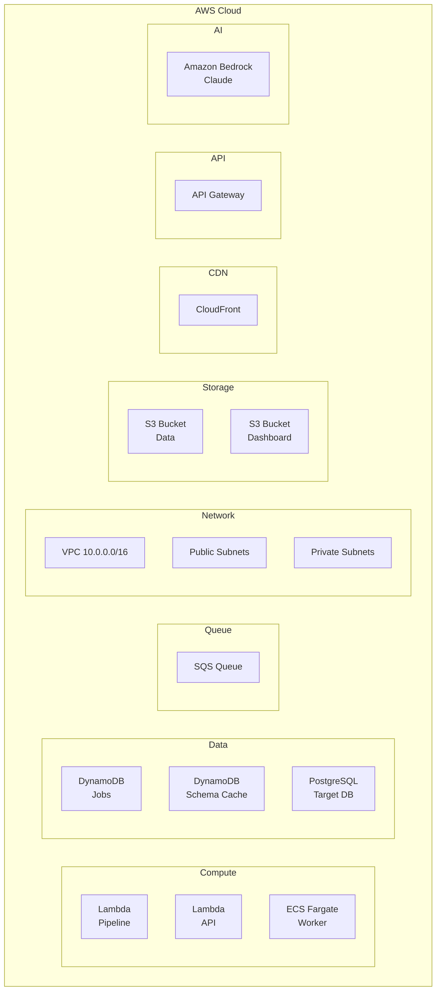
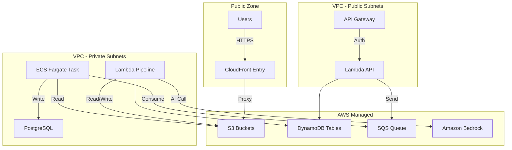
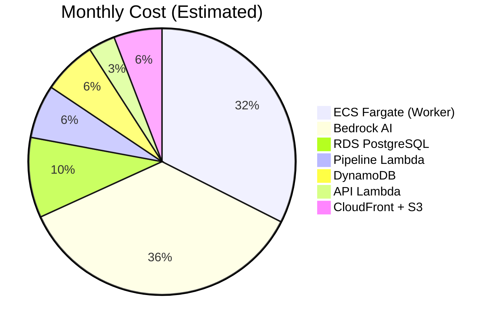
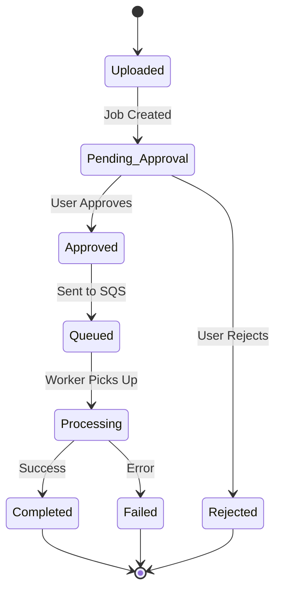

# Nexus Pipeline - Infrastructure Visualization

This document visualizes the complete infrastructure using Mermaid.js diagrams.

## Architecture Overview

## Data Flow Sequence

## Component Details

### Pipeline Flow

### Worker ETL

## Infrastructure Resources

## Security Boundaries

## Cost Breakdown

## Status Flow

